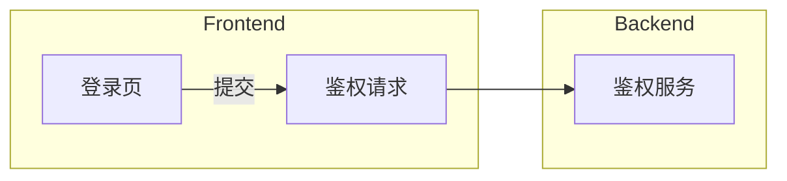

# Mermaid -> Flow2Go Graph JSON v2

## 目标
把 Mermaid flowchart DSL 转成 Flow2Go 的 `GraphBatchPayload`，再以 **一次 batch（reason='ai-apply'）** 应用到画布，保证 undo/redo 不碎裂。

## 支持语法
- `flowchart LR | TB | RL | BT`
- `A`
- `A[文本]`
- `A(文本)`
- `A{文本}`
- `A --> B`
- `A -->|文案| B`
- `subgraph ... end`（V2 支持嵌套 subgraph，用于编组/树形结构）

## V2 新增能力
- **subgraph 嵌套**：内层 subgraph 映射为 **嵌套 Frame**（`graph.createFrame.params.parentId`）
- **节点副标题**：在 `[]` 内用换行编码副标题：
  - `fe_x[主标题\n副标题]`
  - 解析为 `title='主标题'`、`subtitle='副标题'`

## V2 行为更新（重要）
- **不再强制 Frontend/Backend**：顶层 subgraph/画框数量由 AI 根据用户诉求决定（可无、可多、可嵌套）
- **紧凑编组布局**：
  - frame 内若无边：节点按网格紧凑对齐（约 1 个单位间距）
  - frame 内若有边：自动增加间距以保证连线稳定
  - 同级嵌套 frame：默认横向平铺，编组间距约 2 个单位

## 不支持（v1 必须 warning，尽量继续）
- `classDef`
- `style`
- `linkStyle`
- `click`
- `::: class`
- 高级箭头/其它 Mermaid 图类型/HTML label

## 映射规则
- `subgraph` -> **Frame**
  - 输出 `graph.createFrame`
  - Flow2Go 实际节点：`type='group'` 且 `data.role='frame'`
  - V2：若 subgraph 嵌套，则子 Frame 追加 `parentId=父FrameId`
- 普通节点 -> **quad**
  - `A` -> `graph.createNodeQuad`，`title='A'`，`shape='rect'`
  - `A[文本]` -> `title='文本'`，`shape='rect'`
  - `A(文本)` -> `title='文本'`，`shape='circle'`
  - `A{文本}` -> `title='文本'`，`shape='diamond'`
- 边 -> **smoothstep edge**
  - 输出 `graph.createEdge`
  - `type='smoothstep'`，`arrowStyle='end'`
  - `A -->|标签| B` 映射到 `label='标签'`

## Frame/parentId 规则（v1）
- `subgraph` 内的节点：创建时必须带 `parentId=frameId`
- 每个 frame 创建完成后：在 frame 内输出一次 `graph.autoLayout`（`scope='withinFrame'`）
- 若存在顶层节点：额外输出一次 `graph.autoLayout`（`scope='all'`）

## Frame 平铺与嵌套（V2）
- 顶层 Frame（无 `parentId`）会在画布上对齐平铺，避免重叠
- 嵌套 Frame（有 `parentId`）不会参与平铺，会保留在父 Frame 内，形成编组嵌套结构

## 重要约束
- Mermaid 的 `subgraph` 在 v1 中只映射为 Frame，不映射普通 Group
- 所有节点在 subgraph 内时自动挂 `parentId`
- 坐标由布局器处理，不依赖 Mermaid 提供
- 所有 AI 应用应使用 batch 语义

## 输出结构
- 类型定义见 `types.ts`
- 统一结果：

```ts
type MermaidToGraphResult = {
  success: boolean
  data: GraphBatchPayload | null
  warnings: GraphWarning[]
  errors: GraphError[]
}
```

## 操作顺序（必须固定）
`graph.createFrame` → `graph.createNodeQuad` → `graph.createEdge` → `graph.autoLayout`

## 关键业务规则
- 同 id 节点只创建一次，首次定义优先
- 同 id 多次声明且 label 不同：保留首次，warning `NODE_LABEL_CONFLICT`
- 边引用未显式声明节点：自动补建（title=id，shape='rect'），并 warning `NODE_IMPLICIT_CREATE`
- 任何不支持语法：必须产生 warning（尽量带 line/raw）

## API（统一入口）
从 `src/flow/mermaid/index.ts` 导出：
- `parseMermaidFlowchart(input)`：Mermaid → `MermaidFlowIR`
- `transpileMermaidFlowIR(ir, rawMermaid, warnings)`：IR → `GraphBatchPayload`
- `applyMermaidFlowchart(input, ctx)`：一条龙（走 `graph.batch` 或 `applyOperation`）
- `materializeGraphBatchPayloadToSnapshot(payload)`：`async`，payload → Flow2Go nodes/edges 快照（用于草稿/预览；流程图布局使用 **ELK.js layered**）
- `applyGraphBatchPayloadToFlow2Go(payload, ctx)`：payload → 一次性应用到 Flow2Go（一次 pushHistory，reason='ai-apply'）

## 示例

### 最小图


### 带中文节点与边标签 + 多 Frame + 跨 Frame 连线

